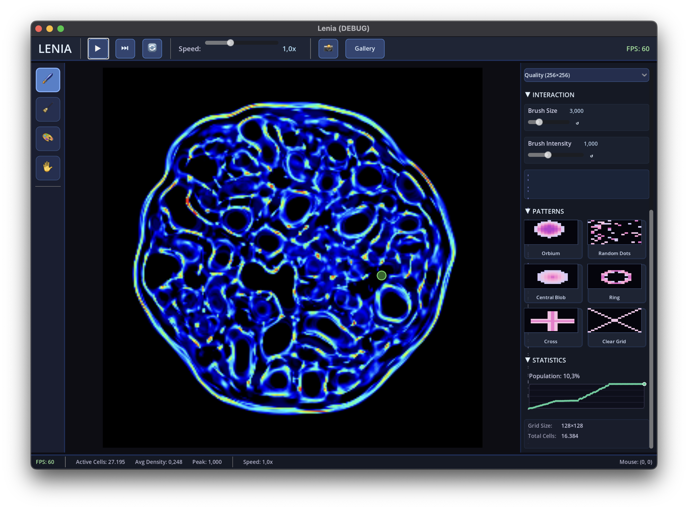
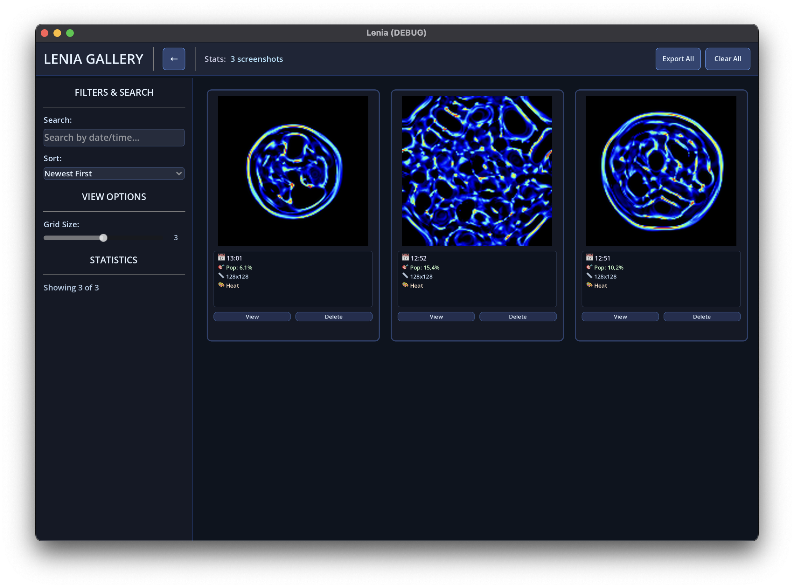
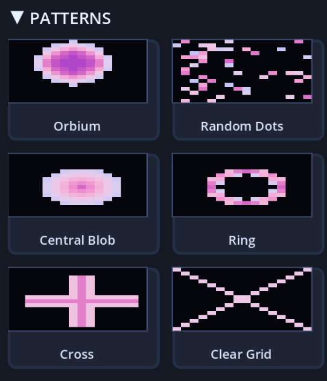

# Lenia - Continuous Cellular Automaton

A beautiful implementation of Lenia, a continuous cellular automaton system, built with Godot 4.4 and C#. Experience the mesmerizing patterns of artificial life evolving in real-time.



## Features

### Core Simulation
- **Real-time Lenia simulation** with optimized parallel processing
- **Configurable parameters**: Growth function, kernel radius, delta time, and more
- **Multiple color schemes**: Heat, Grayscale, Rainbow, and Plasma visualizations
- **Interactive tools**: Paint and erase brushes with adjustable size and intensity
- **Performance modes**: Different grid sizes for optimal performance

### User Interface
- **Modern UI design** with consistent styling throughout
- **Responsive layout** that adapts to different screen sizes
- **Real-time parameter adjustment** with immediate visual feedback
- **Pattern presets**: Quick access to interesting starting configurations
- **Performance monitoring**: Live FPS display and optimization indicators

### Gallery System
- **Screenshot capture**: Save canvas-only images with detailed metadata
- **Gallery browser**: Professional grid/list view with search and filtering
- **Metadata tracking**: Complete simulation state saved with each screenshot
- **Export functionality**: Batch export screenshots with summary reports
- **Dynamic thumbnails**: Responsive grid with size adjustment

## Getting Started

### Prerequisites
- [Godot 4.4+](https://godotengine.org/download) with C# support
- [.NET 8.0 SDK](https://dotnet.microsoft.com/download/dotnet/8.0)

### Installation
1. Clone the repository:
   ```bash
   git clone https://github.com/yourusername/Lenia.git
   cd Lenia
   ```

2. Open the project in Godot:
   - Launch Godot Engine
   - Click "Import" and select the `project.godot` file
   - Build the C# project when prompted

3. Run the simulation:
   - Press F5 or click the Play button
   - Select the main scene (`lenia.tscn`) if prompted

### Building from Command Line
```bash
# Build the C# project
dotnet build

# Run with Godot (if Godot is in PATH)
godot --path . res://lenia.tscn
```

## Usage

### Basic Controls
- **Play/Pause**: Start or stop the simulation
- **Step**: Advance one frame when paused
- **Reset**: Reinitialize with the current pattern
- **Speed Slider**: Adjust simulation speed (0.1x to 3.0x)

### Painting Tools
- **Paint Brush**: Add life to the simulation (left-click)
- **Erase Tool**: Remove life from areas (right-click)
- **Brush Size**: Adjust tool radius
- **Intensity**: Control paint/erase strength

### Gallery Features
- **Screenshot**: Capture current simulation state
- **Gallery**: Browse saved screenshots with metadata
- **Search**: Filter screenshots by date/time
- **Export**: Save collections to external directories

### Parameter Tuning
- **Growth Mean**: Center of the growth function
- **Growth Sigma**: Width of the growth function
- **Kernel Radius**: Neighborhood influence radius
- **Delta Time**: Simulation step size
- **Grid Size**: Canvas resolution (64x64 to 512x512)

## Project Structure

```
Lenia/
├── Scripts/                    # C# source files
│   ├── LeniaSimulation.cs     # Core simulation engine
│   ├── LeniaMainUI.cs         # Main UI controller
│   ├── HeaderBar.cs           # Top toolbar
│   ├── Gallery.cs             # Screenshot gallery
│   ├── ColorMapper.cs         # Visualization engine
│   └── ...
├── lenia.tscn                 # Main scene
├── gallery.tscn               # Gallery scene
├── menu.tscn                  # Menu scene
├── project.godot              # Godot project file
└── Lenia.csproj              # C# project file
```

## Technical Details

### Performance Optimizations
- **Parallel processing** using `Parallel.For` for grid updates
- **Kernel caching** with pre-computed offset arrays
- **Efficient rendering** with direct pixel buffer manipulation
- **Memory management** with object pooling for UI elements

### Architecture
- **Modular design** with separated concerns
- **Signal-based communication** between components
- **Scene composition** for UI flexibility
- **Resource management** for optimal memory usage

## Contributing

We welcome contributions! Please see [CONTRIBUTING.md](CONTRIBUTING.md) for guidelines.

### Development Setup
1. Fork the repository
2. Create a feature branch: `git checkout -b feature/amazing-feature`
3. Make your changes and test thoroughly
4. Commit with descriptive messages
5. Push to your fork and create a Pull Request

### Code Style
- Follow C# naming conventions
- Use meaningful variable and method names
- Add comments for complex algorithms
- Keep methods focused and concise

## Algorithm Background

Lenia is a continuous cellular automaton discovered by Bert Wang-Chak Chan. Unlike Conway's Game of Life with discrete states, Lenia uses continuous values and smooth growth functions, creating organic, lifelike patterns.

### Key Concepts
- **Continuous States**: Cell values range from 0.0 to 1.0
- **Growth Function**: Gaussian-based function determining cell evolution
- **Convolution Kernel**: Defines neighborhood influence
- **Temporal Dynamics**: Continuous time evolution with delta steps

### Mathematical Foundation
The core update rule:
```
A(t+dt) = A(t) + dt * G(K * A(t))
```
Where:
- `A(t)` is the current state
- `K` is the convolution kernel
- `G` is the growth function
- `dt` is the time step

## License

This project is licensed under the MIT License - see the [LICENSE](LICENSE) file for details.

## Acknowledgments

- **Bert Wang-Chak Chan** for discovering Lenia
- **Godot Engine** for the amazing game engine
- **The Lenia community** for research and inspiration

## Screenshots

| Main Interface | Gallery View | Pattern Examples |
|---|---|---|
|  |  |  |

## Links

- [Lenia Research Paper](https://arxiv.org/abs/1812.05433)
- [Godot Engine](https://godotengine.org/)
- [Original Lenia Implementation](https://github.com/Chakazul/Lenia)